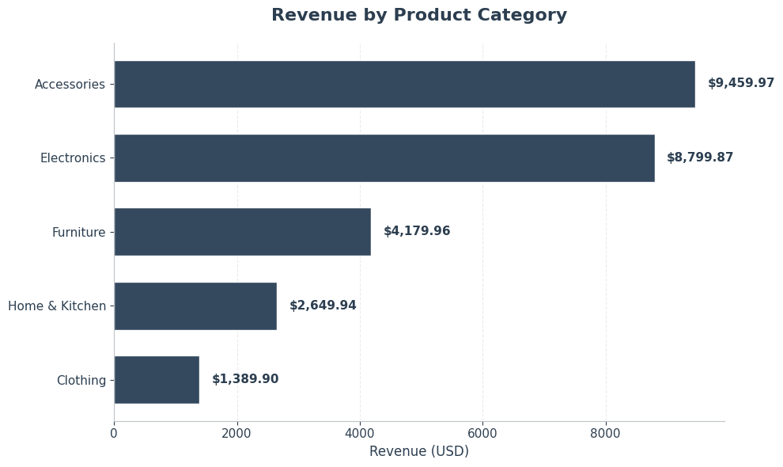
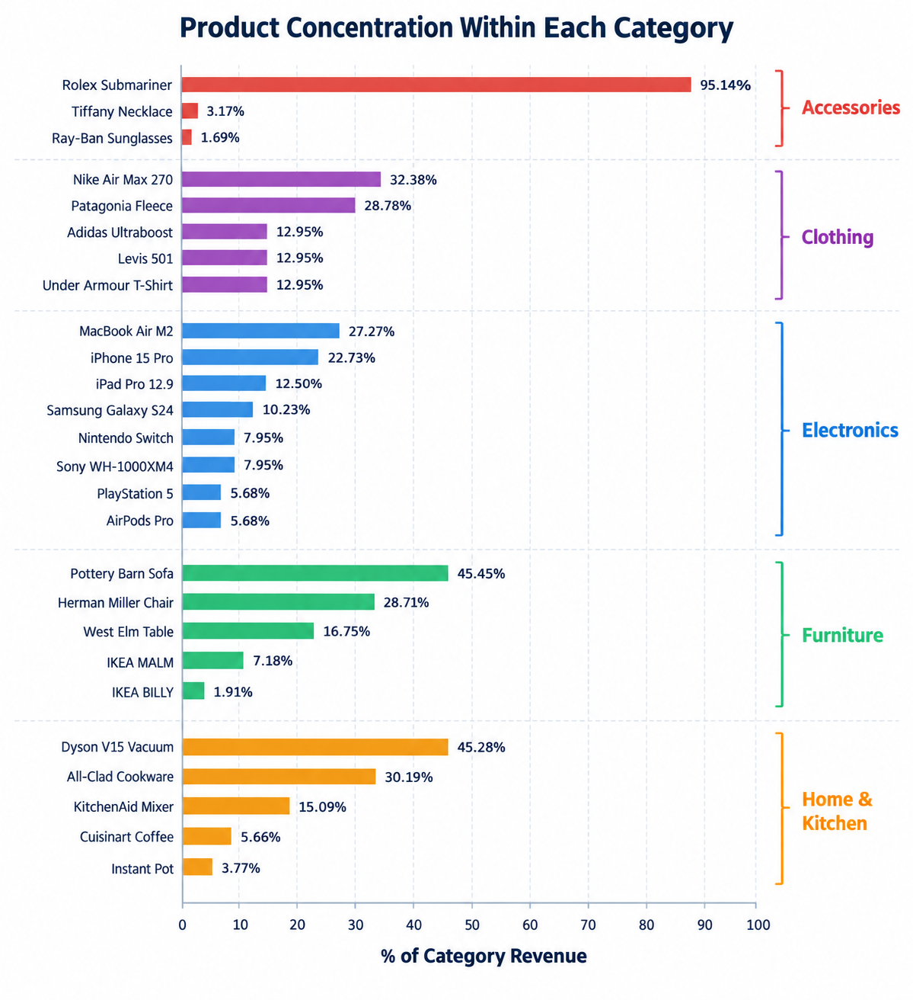

# Advanced SQL: E-commerce Analytics

A hands-on SQL project exploring an e-commerce dataset using 
advanced SQL techniques — window functions, CTEs, ranking, 
and outlier detection. The goal is not just to write queries, 
but to turn raw transactional data into business insights. 

## 📌 Introduction

This project is a deep dive into an e-commerce dataset, 
with the goal of understanding how revenue is distributed 
across products, customers, and time — and where the risks 
and opportunities are hidden. 🔎📊

Throughout this project, I explored the data to answer a 
few key questions:

- 💰 How is revenue distributed across product categories?
- 👥 Which customers drive the most value — and how can 
     we segment them?
- 📈 How do daily sales accumulate over time?
- 🏆 Who is the top customer in each category?
- 🚨 Are there outliers distorting our metrics?

The goal is not just to run queries, but to use advanced 
SQL tools to extract insights that could actually guide 
business decisions.


### Business Questions

The main questions I aimed to answer through this project were:

1. Which product categories generate the most revenue, and how 
   concentrated is that revenue within each category?
2. How can we segment customers into meaningful tiers based on 
   their total spending?
3. How do daily sales accumulate over time, and what does the 
   trend look like?
4. Who is the top-spending customer in each product category?
5. Are there outlier orders distorting our revenue and average 
   order value — and by how much?

   ## 📂 Dataset

The dataset models an e-commerce business with **6 related tables** 
covering customers, orders, line items, products, suppliers, and 
product reviews — 30 orders, 37 line items, and 20 customers in 
total.

Raw CSV files: available in the [ DATASETS ](./datasets) folder.


| Table | Description | Rows |
|---|---|---|
| `customers` | Customer master data (name, location, join date) | 20 |
| `orders` | Order header info (customer, date, total amount, status) | 30 |
| `order_items` | Line items per order (product, quantity, unit price) | 37 |
| `products` | Product catalog (name, category, price, stock) | 30 |
| `suppliers` | Supplier info for products | 5 |
| `product_reviews` | Customer reviews per product | 10 |

**Key relationships:**
- `orders.customer_id` → `customers.customer_id`
- `order_items.order_id` → `orders.order_id`
- `order_items.product_id` → `products.product_id`
- `products.supplier_id` → `suppliers.supplier_id`
- `product_reviews.product_id` → `products.product_id`


## 🛠️ Tools & Technologies

- **PostgreSQL** — Database engine used to store and query the data.
- **SQL** — Core language for all transformations and analysis.
- **Advanced SQL techniques used:**
  - Window Functions (`ROW_NUMBER`, `RANK`, `NTILE`, `LAG`, `LEAD`, `FIRST_VALUE`, `LAST_VALUE`)
  - Aggregate Window Functions (`SUM`, `AVG`, `COUNT` with `OVER`)
  - CTEs (Common Table Expressions) for modular query design
  - `CASE` expressions for classification and conditional aggregation
  - `PERCENTILE_CONT` for statistical analysis (IQR)
  - `CROSS JOIN` for combining computed bounds with row-level data
- **Visual Studio Code** — Main workspace for writing and running queries.
- **Git & GitHub** — Version control and project publishing.


## 📊 The Analysis

The analysis is organized around three angles: **where revenue 
comes from**, **who drives it**, and **how it moves over time**. 
Each section uses advanced SQL techniques — window functions, 
CTEs, and statistical methods — to move from raw transactional 
data to business insights.


### 💰 Where Revenue Comes From

Revenue is not evenly distributed across the catalog. Looking 
at the category level, **Accessories leads with $9,459.97** — 
despite having only 5 products — followed closely by Electronics 
at $8,799.87. Clothing sits at the bottom with just $1,389.90.




But a closer look reveals that the category total is misleading. 
When breaking revenue down by product, **Rolex Submariner alone 
accounts for 95.14% of the Accessories category** — making the 
entire category dependent on a single luxury item. Furniture and 
Home & Kitchen show similar patterns (Pottery Barn Sofa = 45.45%, 
Dyson V15 = 45.28%), though less extreme.



**Key takeaways:**

- ⚠️ **Severe concentration risk** in Accessories: if Rolex stops 
  selling, the category collapses.
- 📉 **Furniture and Home & Kitchen** follow the same fragile 
  pattern — top product drives ~45% of revenue.
- 🚫 **Dell XPS 13 recorded zero sales** — a dead SKU worth 
  investigating (pricing, marketing, or stock issue).

  <details>
<summary>🔍 View SQL Query</summary>

```sql
-- Revenue analysis: product-level revenue + category concentration

WITH order_line_revenue AS (
    SELECT
        p.product_id,
        p.product_name,
        p.category,
        oi.quantity,
        oi.unit_price,
        oi.quantity * oi.unit_price AS line_revenue
    FROM order_items AS oi
    INNER JOIN products AS p ON p.product_id = oi.product_id
),
product_sales AS (
    SELECT
        product_id,
        product_name,
        category,
        SUM(line_revenue) AS product_revenue
    FROM order_line_revenue
    GROUP BY product_id, product_name, category
)
SELECT
    product_id,
    product_name,
    category,
    product_revenue,
    SUM(product_revenue) OVER (PARTITION BY category) AS category_total,
    ROUND(
        product_revenue 
        / SUM(product_revenue) OVER (PARTITION BY category) * 100, 
        2
    ) AS pct_of_category
FROM product_sales
ORDER BY category, product_revenue DESC;

 ```
 </details>


