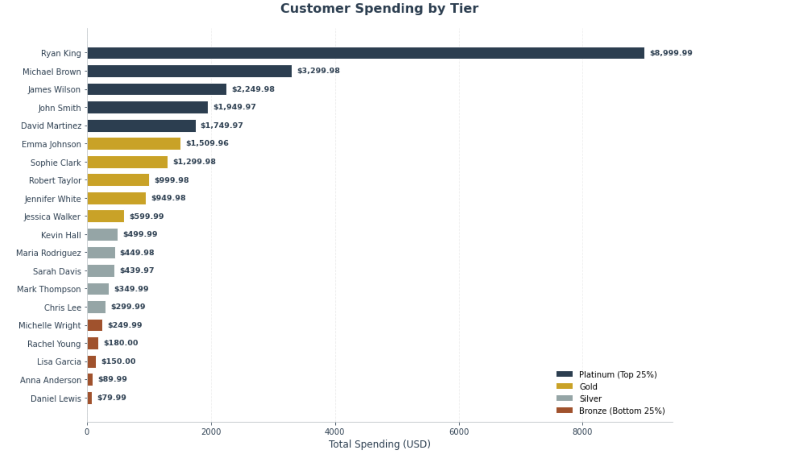
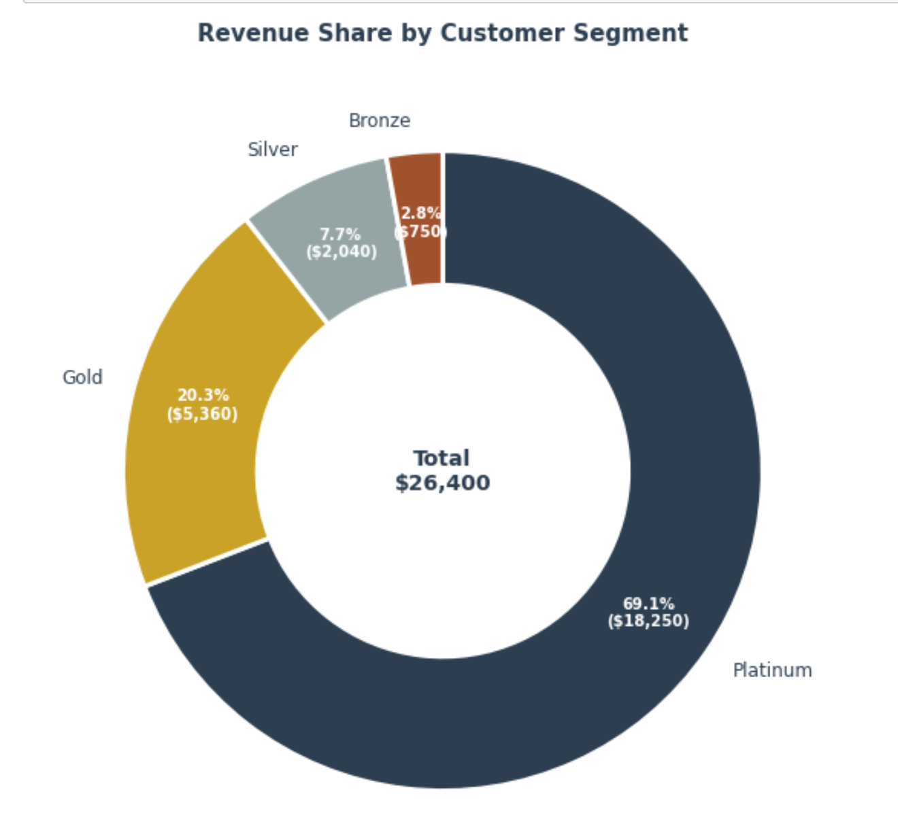
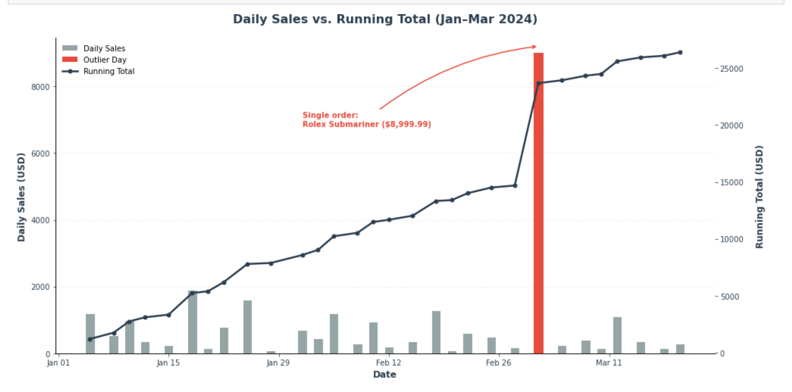
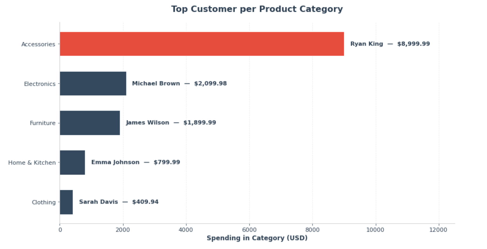
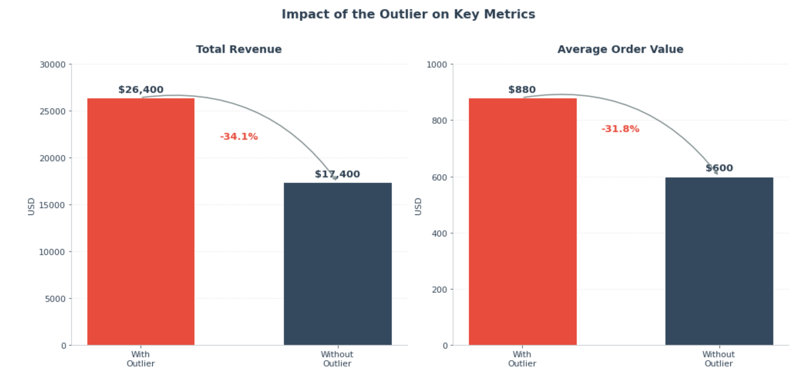
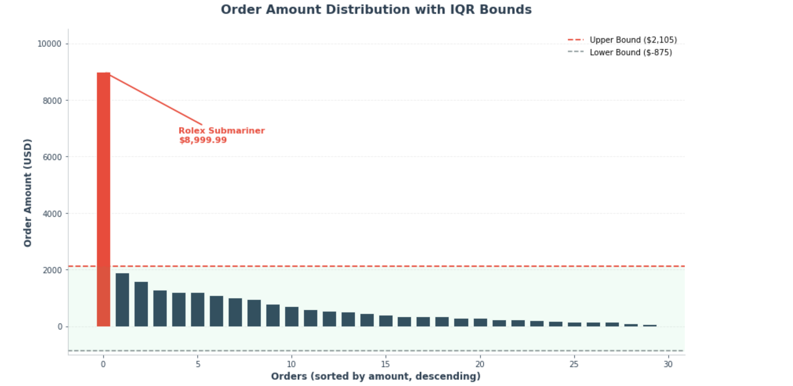

# Advanced SQL: E-commerce Analytics

A hands-on SQL project exploring an e-commerce dataset using 
advanced SQL techniques — window functions, CTEs, ranking, 
and outlier detection. The goal is not just to write queries, 
but to turn raw transactional data into business insights. 

## 📌 Introduction

This project is a deep dive into an e-commerce dataset, 
with the goal of understanding how revenue is distributed 
across products, customers, and time — and where the risks 
and opportunities are hidden. 🔎📊

Throughout this project, I explored the data to answer a 
few key questions:

- 💰 How is revenue distributed across product categories?
- 👥 Which customers drive the most value — and how can 
     we segment them?
- 📈 How do daily sales accumulate over time?
- 🏆 Who is the top customer in each category?
- 🚨 Are there outliers distorting our metrics?

The goal is not just to run queries, but to use advanced 
SQL tools to extract insights that could actually guide 
business decisions.


### Business Questions

The main questions I aimed to answer through this project were:

1. Which product categories generate the most revenue, and how 
   concentrated is that revenue within each category?
2. How can we segment customers into meaningful tiers based on 
   their total spending?
3. How do daily sales accumulate over time, and what does the 
   trend look like?
4. Who is the top-spending customer in each product category?
5. Are there outlier orders distorting our revenue and average 
   order value — and by how much?

   ## 📂 Dataset

The dataset models an e-commerce business with **6 related tables** 
covering customers, orders, line items, products, suppliers, and 
product reviews — 30 orders, 37 line items, and 20 customers in 
total.

Raw CSV files: available in the [ DATASETS ](./datasets) folder.


| Table | Description | Rows |
|---|---|---|
| `customers` | Customer master data (name, location, join date) | 20 |
| `orders` | Order header info (customer, date, total amount, status) | 30 |
| `order_items` | Line items per order (product, quantity, unit price) | 37 |
| `products` | Product catalog (name, category, price, stock) | 30 |
| `suppliers` | Supplier info for products | 5 |
| `product_reviews` | Customer reviews per product | 10 |

**Key relationships:**
- `orders.customer_id` → `customers.customer_id`
- `order_items.order_id` → `orders.order_id`
- `order_items.product_id` → `products.product_id`
- `products.supplier_id` → `suppliers.supplier_id`
- `product_reviews.product_id` → `products.product_id`


## 🛠️ Tools & Technologies

- **PostgreSQL** — Database engine used to store and query the data.
- **SQL** — Core language for all transformations and analysis.
- **Advanced SQL techniques used:**
  - Window Functions (`ROW_NUMBER`, `RANK`, `NTILE`, `LAG`, `LEAD`, `FIRST_VALUE`, `LAST_VALUE`)
  - Aggregate Window Functions (`SUM`, `AVG`, `COUNT` with `OVER`)
  - CTEs (Common Table Expressions) for modular query design
  - `CASE` expressions for classification and conditional aggregation
  - `PERCENTILE_CONT` for statistical analysis (IQR)
  - `CROSS JOIN` for combining computed bounds with row-level data
- **Visual Studio Code** — Main workspace for writing and running queries.
- **Git & GitHub** — Version control and project publishing.


## 📊 The Analysis

The analysis is organized around three angles: **where revenue 
comes from**, **who drives it**, and **how it moves over time**. 
Each section uses advanced SQL techniques — window functions, 
CTEs, and statistical methods — to move from raw transactional 
data to business insights.


### 💰 Where Revenue Comes From

Revenue is not evenly distributed across the catalog. Looking 
at the category level, **Accessories leads with $9,459.97** — 
despite having only 5 products — followed closely by Electronics 
at $8,799.87. Clothing sits at the bottom with just $1,389.90.


But a closer look reveals that the category total is misleading. 
When breaking revenue down by product, **Rolex Submariner alone 
accounts for 95.14% of the Accessories category** — making the 
entire category dependent on a single luxury item. Furniture and 
Home & Kitchen show similar patterns (Pottery Barn Sofa = 45.45%, 
Dyson V15 = 45.28%), though less extreme.


**Key takeaways:**

- ⚠️ **Severe concentration risk** in Accessories: if Rolex stops 
  selling, the category collapses.
- 📉 **Furniture and Home & Kitchen** follow the same fragile 
  pattern — top product drives ~45% of revenue.
- 🚫 **Dell XPS 13 recorded zero sales** — a dead SKU worth 
  investigating (pricing, marketing, or stock issue).

<details>
<summary>🔍 View SQL Query</summary>

```sql
-- Revenue analysis: product-level revenue + category concentration

WITH order_line_revenue AS (
    SELECT
        p.product_id,
        p.product_name,
        p.category,
        oi.quantity,
        oi.unit_price,
        oi.quantity * oi.unit_price AS line_revenue
    FROM order_items AS oi
    INNER JOIN products AS p ON p.product_id = oi.product_id
),
product_sales AS (
    SELECT
        product_id,
        product_name,
        category,
        SUM(line_revenue) AS product_revenue
    FROM order_line_revenue
    GROUP BY product_id, product_name, category
)
SELECT
    product_id,
    product_name,
    category,
    product_revenue,
    SUM(product_revenue) OVER (PARTITION BY category) AS category_total,
    ROUND(
        product_revenue 
        / SUM(product_revenue) OVER (PARTITION BY category) * 100, 
        2
    ) AS pct_of_category
FROM product_sales
ORDER BY category, product_revenue DESC;


 ```
 </details> 


### 👥 Who Drives Revenue

Not all customers are equal. Segmenting the customer base into 
4 equal tiers using `NTILE(4)`, based on total spending, revealed 
a classic Pareto pattern: **the top 25% of customers (Platinum) 
account for 69.1% of total revenue** — while the bottom 25% 
(Bronze) contribute just 2.8%.



The concentration is extreme. **Ryan King (Platinum) alone spent 
$8,999.99** — nearly 3x the second-highest customer and 100x 
the lowest ($79.99). This is not a gradual curve; it is a steep 
cliff.



**Key takeaways:**

- 🎯 **Platinum tier is the business.** Losing even one Platinum 
  customer has a disproportionate impact on revenue. Retention 
  programs here should be a priority.
- 💸 **Extreme spending gap:** $8,999.99 (top) vs $79.99 (bottom) 
  — a 100x difference.
- 🔁 **Bronze tier represents a re-engagement opportunity.** Small 
  incentives could lift these customers into Silver or Gold.
- 📊 **Pareto Principle in action:** 20% of customers → ~70% of 
  revenue.

<details>
<summary>🔍 View SQL Query</summary>

```sql
-- Customer segmentation using NTILE(4) on total spending

WITH customer_spending AS (
    SELECT
        c.customer_id,
        c.first_name || ' ' || c.last_name AS customer_name,
        SUM(o.total_amount) AS total_spent
    FROM customers AS c
    LEFT JOIN orders AS o ON c.customer_id = o.customer_id
    GROUP BY c.customer_id, c.first_name, c.last_name
),
segmentation AS (
    SELECT
        customer_id,
        customer_name,
        total_spent,
        NTILE(4) OVER (ORDER BY total_spent DESC) AS quartile
    FROM customer_spending
)
SELECT
    customer_id,
    customer_name,
    total_spent,
    quartile,
    CASE
        WHEN quartile = 1 THEN 'Platinum'
        WHEN quartile = 2 THEN 'Gold'
        WHEN quartile = 3 THEN 'Silver'
        ELSE 'Bronze'
    END AS segment
FROM segmentation
ORDER BY total_spent DESC;

```

</details> 


### 📈 How Sales Move Over Time

Across the 3-month period (Jan–Mar 2024), total revenue reached 
**$26,399.67** across **30 distinct order dates**. But looking 
at day-to-day activity, sales fluctuate significantly — daily 
revenue ranges from **$79.99 to $1,899.99** (excluding one 
outlier day), with no clear upward or downward trend.



The chart tells an important story: the running total line climbs 
steadily — **except for one massive jump on Mar 2**. That single 
day added **$8,999.99** (the Rolex purchase), accounting for 
**34% of the entire quarter's revenue**.

**Key takeaways:**

- 📊 **No organic growth trend.** Sales are flat with high 
  volatility — no consistent acceleration.
- ⚠️ **One day distorts the picture.** Mar 2's $8,999.99 was a 
  single luxury sale, not a demand spike.
- 💡 **Baseline revenue is ~$600/day**, not the $880 average 
  that includes the outlier.

<details>
<summary>🔍 View SQL Query</summary>

```sql
-- Daily sales with cumulative running total

WITH day_sales AS (
    SELECT
        order_date,
        SUM(total_amount) AS daily_sales
    FROM orders
    GROUP BY order_date
)
SELECT
    order_date,
    daily_sales,
    SUM(daily_sales) OVER (ORDER BY order_date) AS running_total
FROM day_sales
ORDER BY order_date ASC;

```

</details>


### 🏆 Top Customer per Category

Not all customers shop the same way. Drilling into the data 
by category reveals that **no single customer dominates more 
than one category** — each of the 5 categories has a distinct 
top spender.



But the gap between categories is striking: from **$8,999.99 
in Accessories** (Ryan King) to **$409.94 in Clothing** (Sarah 
Davis) — a **22x difference** driven entirely by one luxury 
purchase.

**Key takeaways:**

- 🎯 **Diversified top spenders per category** — different 
  customers lead different segments, which lowers single-
  customer risk across the portfolio.
- ⚠️ **But Accessories is fully dependent on one customer.** 
  Ryan King's $8,999.99 accounts for **95.14%** of the entire 
  Accessories revenue — losing him would collapse the category.
- 💡 **Electronics and Furniture** show more balanced leaders 
  (~$2K each), suggesting healthier demand distribution.

<details>
<summary>🔍 View SQL Query</summary>

```sql
-- Top-spending customer per product category

WITH customer_category_spending AS (
    SELECT
        o.customer_id,
        c.first_name || ' ' || c.last_name AS customer_name,
        p.category,
        SUM(oi.unit_price * oi.quantity) AS spent_in_category
    FROM order_items AS oi
    INNER JOIN orders    AS o ON o.order_id = oi.order_id
    INNER JOIN products  AS p ON p.product_id = oi.product_id
    INNER JOIN customers AS c ON c.customer_id = o.customer_id
    GROUP BY o.customer_id, p.category, c.first_name, c.last_name
),
category_spending AS (
    SELECT
        category,
        customer_name,
        spent_in_category,
        ROW_NUMBER() OVER (
            PARTITION BY category 
            ORDER BY spent_in_category DESC
        ) AS rn
    FROM customer_category_spending
)
SELECT
    category,
    customer_name,
    spent_in_category
FROM category_spending
WHERE rn = 1
ORDER BY category ASC;

```

</details>


### 🚨 The Outlier That Changes Everything

Using the **IQR method** on order amounts, only **1 order** was 
flagged as an outlier — order #23 (Rolex Submariner at $8,999.99). 
But its impact on the metrics is enormous.



The numbers speak for themselves:

| Metric | With Outlier | Without Outlier | Change |
|---|---:|---:|---:|
| Total Revenue | $26,399.67 | $17,399.68 | **-34.1%** |
| Average Order | $879.99 | $599.99 | **-31.8%** |

Looking at the distribution of orders, the outlier stands clearly 
apart — sitting far above the upper bound, while every other order 
falls within the expected range.



**Key takeaways:**

- ⚠️ **One order (3.3% of the dataset) drives 34% of revenue.** 
  This is the definition of concentration risk.
- 💡 **True baseline AOV is ~$600**, not ~$880. The $880 figure 
  is distorted by a single luxury sale.
- 🎯 **Pricing and marketing decisions should use the $600 
  baseline** — not the inflated metric. Decisions built on 
  distorted data lead to distorted outcomes.

<details>
<summary>🔍 View SQL Query</summary>

```sql
-- Outlier detection using the IQR method (1.5 × IQR rule)

WITH quartiles AS (
    SELECT
        PERCENTILE_CONT(0.25) WITHIN GROUP (ORDER BY total_amount) AS q1,
        PERCENTILE_CONT(0.75) WITHIN GROUP (ORDER BY total_amount) AS q3
    FROM orders
),
bounds AS (
    SELECT
        q3 - q1                     AS iqr,
        q1 - 1.5 * (q3 - q1)        AS lower_bound,
        q3 + 1.5 * (q3 - q1)        AS upper_bound
    FROM quartiles
),
flagged AS (
    SELECT
        o.order_id,
        o.total_amount,
        b.lower_bound,
        b.upper_bound,
        CASE
            WHEN o.total_amount > b.upper_bound THEN TRUE
            WHEN o.total_amount < b.lower_bound THEN TRUE
            ELSE FALSE
        END AS is_outlier
    FROM orders AS o
    CROSS JOIN bounds AS b
)
SELECT
    SUM(total_amount)                                            AS total_revenue,
    SUM(CASE WHEN is_outlier = FALSE THEN total_amount END)     AS total_revenue_excl_outliers,
    AVG(total_amount)                                            AS avg_order,
    AVG(CASE WHEN is_outlier = FALSE THEN total_amount END)     AS avg_order_excl_outliers
FROM flagged;

```


</details>


## 🎯 Summary of Findings

Reading across all five analyses, one theme keeps surfacing: 
**the business is dangerously concentrated.** A single customer, 
a single product, and a single order distort almost every metric.

Three numbers tell the whole story:

| Metric | Value | Implication |
|---|---:|---|
| Top customer's share of revenue | **69.1%** | Losing one customer collapses the top tier |
| Rolex's share of Accessories category | **95.1%** | One product defines an entire category |
| Outlier order's share of total revenue | **34.1%** | One order skews AOV by +$280 |

**What this means in practice:**

- 📊 **The "true" baseline AOV is ~$600**, not the $880 reported 
  by raw averages. Every metric that includes the Rolex order is 
  inflated.
- ⚠️ **Accessories as a category is at risk.** Without Rolex, it 
  drops from $9,460 to $460 — a category that's essentially one 
  product deep.
- 🎯 **Retention of Platinum customers is the single highest-ROI 
  lever.** Losing Ryan King alone costs the business ~34% of revenue.
- 🚫 **Dell XPS 13 has zero sales** — a catalog dead weight that 
  warrants investigation (pricing, positioning, or removal).
- 📈 **No organic growth trend exists.** Sales are flat with high 
  volatility — the business is transaction-driven, not momentum-driven.

**If I had to give one recommendation:** the business needs to 
diversify. Whether through acquiring more mid-tier customers, 
expanding the product mix, or reducing dependence on any single 
entity — reducing concentration is the strategic priority.


## 🧠 What I Learned

This project pushed me beyond writing queries — it changed 
how I think about data.

- **Advanced SQL as a tool, not a skill.** Window functions, 
  CTEs, and percentile-based methods aren't syntax to memorize — 
  they're tools that let me ask better questions.

- **Thinking in layers.** Building complex analysis with multiple 
  CTEs taught me to break problems into small, testable steps 
  instead of writing one massive query.

- **Learning to distrust clean numbers.** A single $8,999 order 
  made the average look like $880 — when the true baseline was 
  ~$600. Clean numbers can hide distorted stories.

- **From queries to insights.** I stopped asking "how do I write 
  this?" and started asking "what decision does this support?"


  ## 🚀 How to Run

1. Clone the repository.
2. Load the CSV files from `/datasets` into a PostgreSQL database.
3. Run any query from the `/queries` folder in your SQL client 
   (psql, pgAdmin, or the VS Code PostgreSQL extension).

**Requirements:** PostgreSQL 13+

